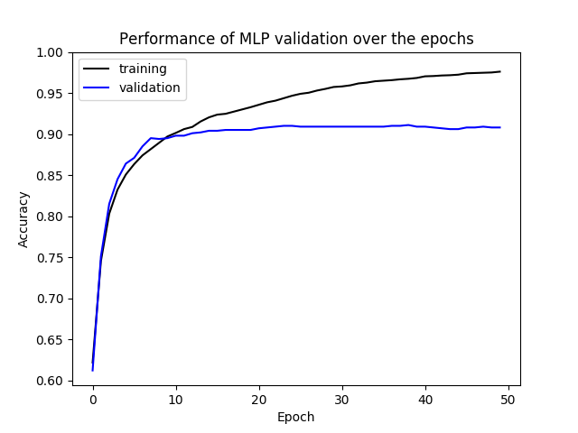
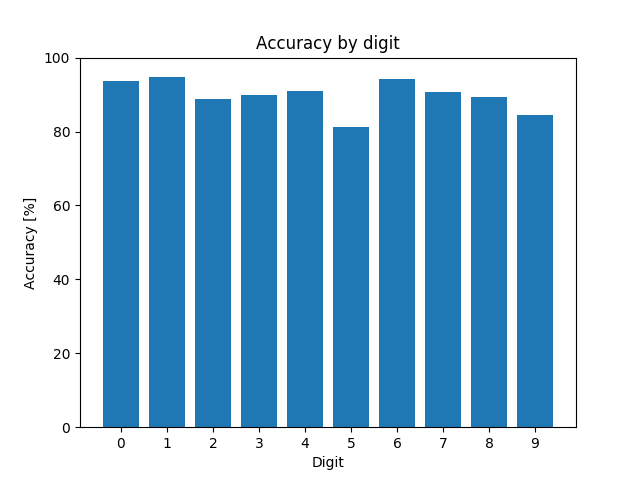
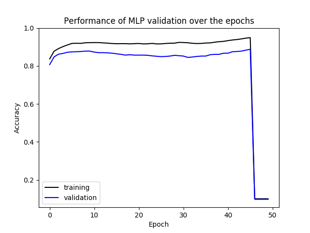
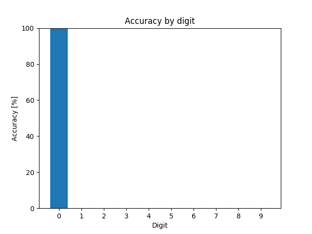
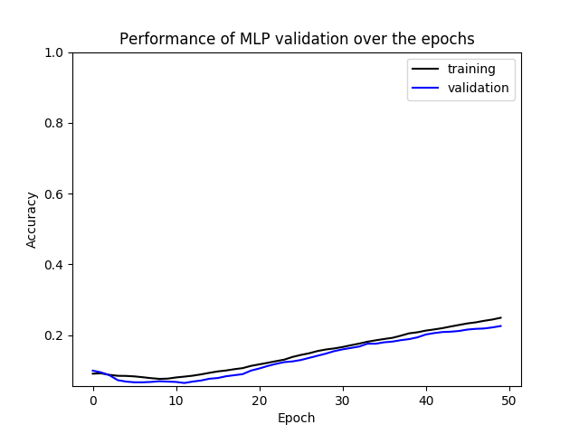
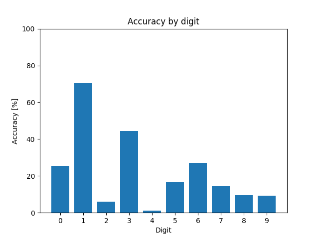

# Solution to Exercise 3 of the NN Praktikum
After implementing the missing methods to get the MLP running, we added two additional hyperparameters to the
`MultilayerPerceptron()` class. First we added a `weightDecay` parameter for **regularization**, then we added the ability 
to choose the hidden layer size via the `layers` parameter. Additionally, we added some custom plotting methods to get
better insight into the results achieved. 

## Hyperparameter Optimization
For hyperparameter optimization we used the [GPyOpt](https://github.com/SheffieldML/GPyOpt) framework to perform bayesian 
optimization. The implementation can be seen in `src/hyperparameter_optimization.py`.
The optimization was performed with 15 initial random samples followed by 15 iterations of optimization. 
Each hyperparameter configuration was trained for 50 epochs. The best result was selected using the validation set accuracies.

## Best result 
Using this method our best accuracy was **89.90%** on the test set. The configuration was the following:

|hidden layer size|learning rate|weight decay|training accuracy|validation accuracy|test accuracy|
|:---:|:---:|:---:|:---:|:---:|:---:|
|32|0.0418422274989|1.78741231682e-05|97.60 %|90.80 %|89.90 %|

Below you can see the training plot for this configuration and the accuracy breakdown with respect to the individual digits.
 
 Training performance             |  Digit recognition accuracy
:-------------------------:|:-------------------------:
 |

## Observations
The configurations generated by the optimizer were not very successful, however the initial 15 randomly generated samples
generated some good results. Many of the later configurations resulted in plots like the one seen on the left below, where 
performance would drastically deteriorate late in the training (always around epoch 46). Looking at the digit histograms 
(one shown on the right) revealed, that all of them would always output zero as the recognized digit. We noticed that this 
happens only in configurations with a layer size of 256 neurons and a high learning rate. 

 sudden performance drop | Digit recognition accuracy
:-------------------------:|:-------------------------:
 |
 
Other effects, such as a low learning rate failing to produce good results within 50 epochs, were also observed.

low learning rate | Digit recognition accuracy
:-------------------------:|:-------------------------:
 |
 
## All results
The following table shows the tested configurations and scores:

|step|hidden layer size|learning rate|weight decay|training accuracy|validation accuracy|test accuracy|
|:---:|:---:|:---:|:---:|:---:|:---:|:---:|
|1|32|0.0418422274989|1.78741231682e-05|97.60 %|**`90.80 %`**|89.90 %|
|2|8|0.0907453549467|9.76393646578e-05|95.83 %|85.90 %|84.40 %|
|3|64|0.000172190706187|7.84744349821e-05|24.93 %|22.60 %|23.50 %|
|4|256|0.0707329189913|4.29675948671e-05|95.13 %|87.20 %|87.30 %|
|5|256|0.026932270069|9.63084534429e-05|96.63 %|88.90 %|89.40 %|
|6|128|0.0743280786819|8.85830011456e-05|99.13 %|88.20 %|88.90 %|
|7|16|0.0590977376869|1.11571454573e-05|97.90 %|89.50 %|89.40 %|
|8|32|0.055969322778|6.62855742364e-05|98.93 %|90.40 %|89.30 %|
|9|32|0.0788644580852|3.70011840653e-05|99.27 %|90.50 %|90.00 %|
|10|256|0.0787216972952|6.5747718923e-06|10.07 %|9.80 %|9.40 %|
|11|256|0.0304929462845|9.60641859744e-05|97.03 %|89.50 %|89.30 %|
|12|256|0.0584968040707|6.69196070603e-05|95.10 %|87.10 %|88.10 %|
|13|64|0.0849891555276|6.32992268136e-06|98.73 %|90.60 %|89.40 %|
|14|64|0.0962664500214|7.10503581839e-05|99.87 %|89.80 %|88.40 %|
|15|128|0.0947937882623|8.8191317151e-05|99.90 %|87.30 %|88.60 %|
|16|64|0.000459405931883|2.34915879102e-05|56.53 %|54.20 %|52.40 %|
|17|64|0.000233300991458|6.67758741875e-05|36.00 %|33.30 %|31.90 %|
|18|256|0.078750183128|4.30647312983e-05|10.07 %|9.80 %|9.40 %|
|19|256|0.0786175216514|0.0001|98.63 %|87.60 %|86.60 %|
|20|64|0.000162004696667|1.39268834191e-05|26.13 %|27.60 %|24.70 %|
|21|256|0.0787607326125|4.74332655463e-06|10.07 %|9.80 %|9.40 %|
|22|64|7.69690581203e-05|7.73987118615e-05|22.40 %|23.00 %|24.20 %|
|23|64|0.00201292926177|8.38627847777e-05|83.03 %|82.10 %|81.90 %|
|24|256|0.0787990982633|4.63718529514e-05|10.07 %|9.80 %|9.40 %|
|25|256|0.0787622918345|3.04150945246e-05|10.07 %|9.80 %|9.40 %|
|26|256|0.0788297676956|0.0001|10.07 %|9.80 %|9.40 %|
|27|256|0.0789254082653|7.68899829327e-05|10.07 %|9.80 %|9.40 %|
|28|256|0.0790486917858|0.0001|10.07 %|9.80 %|9.40 %|
|29|256|0.0790427350146|1e-06|10.07 %|9.80 %|9.40 %|
|30|256|0.0791753261566|3.4367873949e-05|10.07 %|9.80 %|9.40 %|

Plots for all of the above configurations can be found in `src/plots`.